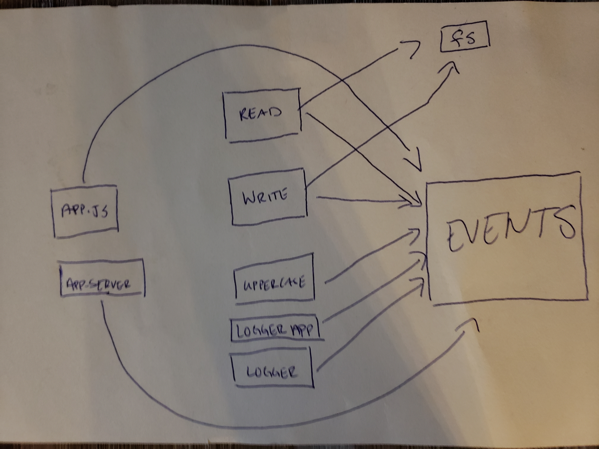

# LAB - Class 17

### Author: Naseem & Ibrahim 

### Links and Resources

- [submission PR](https://github.com/naseem-401-advanced-javascript/lab-17/tree/class17)

### Setup
npm i jest eslint

#### How to initialize/run your application (where applicable)

- `npm test`

#### Tests

- How do you run tests?
     - 'npm test'

#### UML
